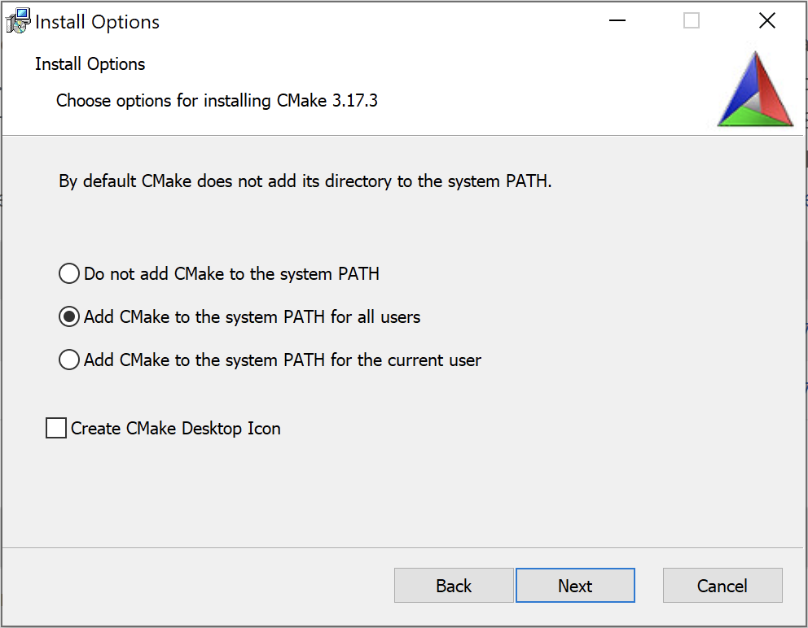
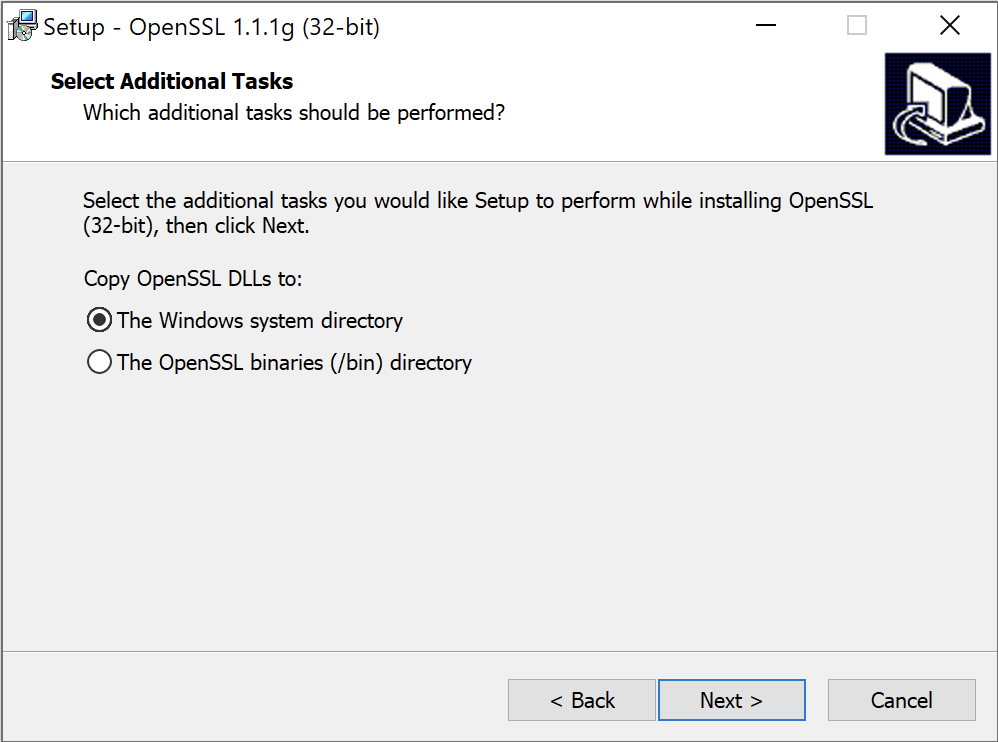

.. meta::
   :description: Tarm-io build instructions for Windows

.. role:: bash(code)
   :language: bash

Build for Windows
=================

As usual everything is a bit complicated for Windows.
We will go from the most basic scenarios to more complex topics below.
Most of the work is made here via command line. Code examples here suppose usage of Power Shell.
It has numerous advantages over classic cmd.

Both x86 and x64 builds are supported on both x86 and x64 hosts.
So you can compile and use 64 bit and 32 bit versions of the library on x64 machine.

Install dependencies
--------------------

Visual Studio
~~~~~~~~~~~~~

First, you'll need build tools on your machine if you don't have one.
You can always download and use community edition of Visual Studio from the `Microsoft website <https://visualstudio.microsoft.com/vs/older-downloads/>`_.

During installation do not forget to enable C++ tools for desktop.

.. TODO: screenshot

CMake
~~~~~

Download `CMake <https://cmake.org/download/#latest>`_ installer for your platform.
During installation it is highly recommended to add **cmake** executable in the PATH,
because all following instructions assume that. Of course everything could be done via GUI.

Configure and build
-------------------

Build is performed in separate directory:

.. code-block:: bash

   mkdir build
   cd build

Note that unlike Linux or Mac OS builds with make files generator you do not need to pass
`CMAKE_BUILD_TYPE <https://cmake.org/cmake/help/v3.15/variable/CMAKE_BUILD_TYPE.html>`_
parameter during configuration.

CMake 3.15 and above
~~~~~~~~~~~~~~~~~~~~

If you have CMake 3.15+ (which is recommended) you may not specify 
`CMAKE_INSTALL_PREFIX <https://cmake.org/cmake/help/v3.16/variable/CMAKE_INSTALL_PREFIX.html>`_ during CMake configuration step.
Prefix will be defined later during installation step and could be changed without CMake reconfiguration.

.. code-block:: bash
   :caption: x64
   
   cmake -DCMAKE_VS_PLATFORM_TOOLSET_HOST_ARCHITECTURE=x64 -DCMAKE_GENERATOR_PLATFORM=x64 ..

or

.. code-block:: bash
   :caption: x86
   
   cmake -DCMAKE_VS_PLATFORM_TOOLSET_HOST_ARCHITECTURE=x86 -DCMAKE_GENERATOR_PLATFORM=Win32 ..

And to build and install execute:

.. code-block:: bash

   cmake --build . --config Release -j4
   cmake --install . --config Release --prefix X:\tarm-io-install
   cmake --build . --config Debug -j4
   cmake --install . --config Debug --prefix X:\tarm-io-install

Debug and release builds reside in the same prefix folder.
CMake allow automatically to select required one when dependent code is built.
Note, debug build steps may be skipped if you do not need one.

.. note::
   Do not forget to replace 'X:\\tarm-io-install' with your own installation path.

.. error::
   x86 and x64 platform builds should NOT be installed into the same prefix.

CMake prior to 3.15
~~~~~~~~~~~~~~~~~~~

Older CMake versions require to specify `CMAKE_INSTALL_PREFIX <https://cmake.org/cmake/help/v3.16/variable/CMAKE_INSTALL_PREFIX.html>`_
during CMake configuration step.

.. code-block:: bash
   :caption: x64
   
   cmake -DCMAKE_INSTALL_PREFIX="X:\tarm-io-install" `
         -DCMAKE_VS_PLATFORM_TOOLSET_HOST_ARCHITECTURE=x64 `
         -DCMAKE_GENERATOR_PLATFORM=x64 `
         ..

or

.. code-block:: bash
   :caption: x86
   
   cmake -DCMAKE_INSTALL_PREFIX="X:\tarm-io-install" `
         -DCMAKE_VS_PLATFORM_TOOLSET_HOST_ARCHITECTURE=x86 `
         -DCMAKE_GENERATOR_PLATFORM=Win32 `
         ..

And to build and install execute:

.. code-block:: bash

   cmake --build . --config Release -j4
   cmake --build . --config Release --target install
   cmake --build . --config Debug -j4
   cmake --build . --config Debug --target install

Installation layout
~~~~~~~~~~~~~~~~~~~

Library follows UNIX structure of destination folders. Below is truncated example.

.. code-block:: bash

   .
   |-- bin
   |   |-- libtarm-io.dll
   |   `-- libtarm-io_d.dll
   |-- include
   |   `-- tarm
   |       `-- io
   |           |-- BacklogWithTimeout.h
   |           |-- ByteSwap.h
   |           |   ...
   |           |-- UserDataHolder.h
   |           |-- fs
   |           |   |-- Dir.h
   |           |   |-- DirectoryEntryType.h
   |           |   ...
   |           |-- global
   |           |   `-- Configuration.h
   |           `-- net
   |               |-- BufferSizeResult.h
   |               |-- Endpoint.h
   |               ...
   `-- lib
      |-- cmake
      |   |-- tarm-io
      |   |-- tarm-ioConfig.cmake
      |   |-- tarm-ioConfigVersion.cmake
      |   |-- tarm-ioTargets-debug.cmake
      |   |-- tarm-ioTargets-release.cmake
      |   `-- tarm-ioTargets.cmake
      |-- libtarm-io.lib
      `-- libtarm-io_d.lib

Build examples
--------------

Examples could be found in the project root *'examples'* folder.
As usual, examples are built in a separate directory.

.. code-block:: bash

   mkdir build
   cd build

Examples require library built and installed in some folder.
During configuration step of examples tarm-io library is searched using CMake routines.
As usual this a bit complicated on Windows.
The simplest way to find library is to install it to some system-related folder like "Program Files"
or in folder that is referenced in some system-related environment variable like PATH or INCLUDE.
For more details read `find_library <https://cmake.org/cmake/help/latest/command/find_library.html>`_
command description.

Modification of PATH also may look like:

.. code-block:: bash

   $env:Path += ";X:\tarm-io-install"
   cmake ..

Another approach is to set 'tarm-io_DIR' variable during CMake configuration.
It requires full path to CMake config subfolders in the installation prefix.

.. code-block:: bash

   cmake -Dtarm-io_DIR="X:\tarm-io-install\lib\cmake\tarm-io" ..

And one more approach is to define
`CMAKE_PREFIX_PATH <https://cmake.org/cmake/help/latest/variable/CMAKE_PREFIX_PATH.html>`_:

.. code-block:: bash

   cmake -DCMAKE_PREFIX_PATH="X:\tarm-io-install" ..

And finally...

.. code-block:: PowerShell

   cmake --build . --config Release -j4
   .\hello_event_loop\Release\hello_event_loop.exe
   Hello EventLoop!

If you get message like below during configuration step,
it means that found target architecture version of the library and architecture of a current build do not match.

.. code-block:: bash

  CMake Error at very_basic_udp_echo_server/CMakeLists.txt:8 (find_package):
  Could not find a configuration file for package "tarm-io" that is
  compatible with requested version "".

  The following configuration files were considered but not accepted:

    X:/tarm-io-install/lib/cmake/tarm-io/tarm-ioConfig.cmake, version: 1.0.0 (64bit)

.. caution::
   You need to clean the build directory if encountered error above.

Build with OpenSSL and secure protocols support
-----------------------------------------------

If you want to get a build with protocols like TLS and DTLS, you need to get OpenSSL development files.
There are several ways to get them (from harder and more secure to easier and less secure):

* Build it by yourself
* Use some "package manager" for Windows like `Chocolatey <https://chocolatey.org/docs/installation>`_ or `vcpkg <https://github.com/microsoft/vcpkg>`_
* Download `installer <https://slproweb.com/products/Win32OpenSSL.html>`_ with prebuilt dlls

If you chose standard directory like 'Program Files' for destination,
CMake will be able to find this library without specifying a root path.

Add to configurations steps above location of OpenSSL install directory.
For example, for x64:

.. code-block:: bash

   cmake -DCMAKE_VS_PLATFORM_TOOLSET_HOST_ARCHITECTURE=x64 `
         -DCMAKE_GENERATOR_PLATFORM=x64 `
         -DOPENSSL_ROOT_DIR="X:\Some Path\OpenSSL-Win64" `
         ..

CMake configuration output should look like this:

.. code-block:: bash

   ...
   -- Selecting Windows SDK version 10.0.17763.0 to target Windows 10.0.19041.
   -- Platform is: Windows
   -- Searching for OpenSSL...
   -- OpenSSL include dir: C:/Program Files/OpenSSL-Win64/include
   TARM_IO_OPENSSL_ROOT_DIR: C:\Program Files\OpenSSL-Win64
   ...
   ================ Configuration summary ================
   OpenSSL support: TRUE
   ...

Then build and install as described in previous sections.

.. TODO: test cmake variables described below!

Additionally you may define :bash:`-DOPENSSL_USE_STATIC_LIBS=TRUE` if want to link OpenSSL statically into tarm-io library.
And add :bash:`-DOPENSSL_MSVC_STATIC_RT=TRUE` to use version of OpenSSL with statically linked runtime (msvcr).

Getting DLLs into your own build directory
------------------------------------------

If you did not chose to link everything statically (and most people don't),
to launch and debug apps tarm-io.dll and OpenSSL DLLs are needed to be reachable.

There are several approaches to make it happen:

* Use CMake's `fixup_bundle <https://cmake.org/cmake/help/latest/module/BundleUtilities.html>`_
* `SetDllDirectoryA <https://docs.microsoft.com/en-us/windows/win32/api/winbase/nf-winbase-setdlldirectorya>`_ WinAPI call
* Copy dlls to some system path like 'C:\\Windows\\System32' (see example of OpenSSL installation screenshot below)
* Copy all DLLs to the executable folder

Every of this approaches has its own benefits and drawbacks. We use the last one.
Fortunately, tarm-io CMake routines help here.
The library verifies and remembers location of the OpenSSL dlls during build and has handy variables to make their management easy.
Below is complete example of tarm-io library integration into some project.

.. literalinclude:: ../../../examples/hello_event_loop/CMakeLists.txt
   :caption: CMakeLists.txt
   :language: CMake
   :linenos:
   :lines: 11-

Note that tarm-io CMake scripts are smart enough and able to detect if OpenSSL is available in system paths,
so case the libraries will not be copied and :bash:`TARM_IO_SSL_EAY_DLL_PATH` variable will be empty.